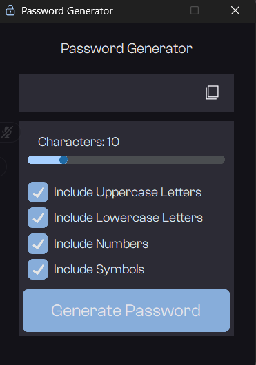

# Password Generator

A Password Generator App built with Python using **CustomTkinter**.

This project can generate secure random passwords that include **lowercase letters**, **uppercase letters**, **numbers and symbols**.

---

## Design Inspiration
I've been inspired by the design from the "Pomo" app for Desktop and Mobile


---

## Features

- Options to include lowercase/uppercase letters, numbers and symbols

---

## Menu


---

## Requirements

Make sure you have **Python 3.7+** installed. Then install the required libraries:

```bash
pip install customtkinter pillow pyglet
